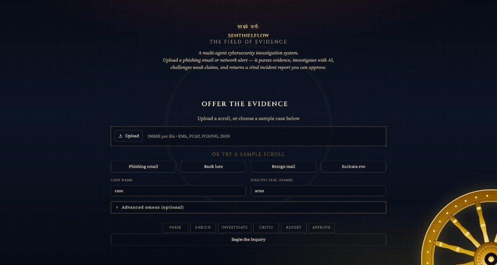
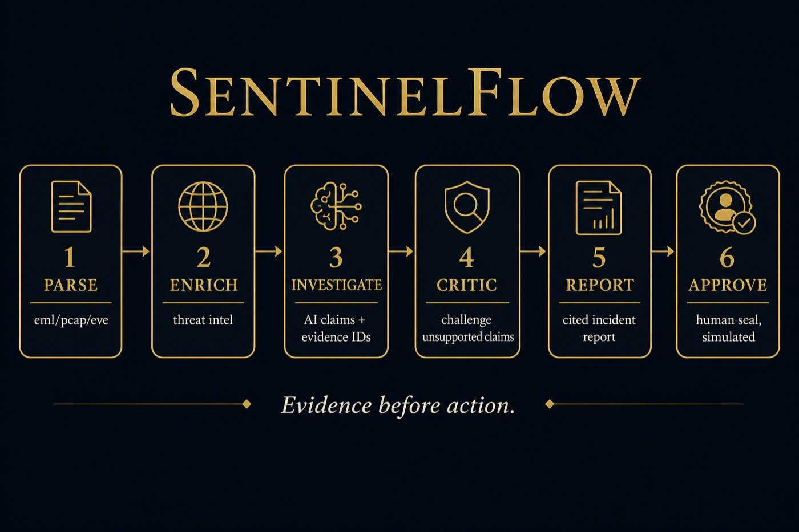

# SentinelFlow

Evidence-grounded multi-agent cybersecurity investigation system.

Raw security evidence (phishing emails, network telemetry) goes in. A traceable
incident report comes out — every claim cites extracted evidence, and a Critic
agent challenges claims that do not hold up.

**Core design decision:** deterministic work (parsing) is done in plain code.
The LLM only ever sees clean, structured, already-extracted evidence.

<p align="center">
  
</p>

<p align="center"><em>Stage 8 UI — upload or pick a sample, watch the inquiry path, seal recommended actions (simulated only).</em></p>

---

## Pipeline

<p align="center">
  
</p>

```
.eml / .pcap / eve.json
   │  deterministic parsers (no LLM)
   ▼
Evidence objects (stable IDs) → SQLite store
   │
   ▼
Investigator ── hypothesis with evidence-cited claims
   │
   ▼
Mechanical precheck (code): do all cited evidence IDs exist?
   │
   ▼
Critic ── judges whether cited evidence actually supports each claim
   │
 approve ──────────────► Report agent (no new facts, defanged IOCs)
   │
 revise (max 2) ──► Investigator revises
   │
 still rejected ──► UNRESOLVED: human review required (first-class outcome)
```

Orchestration is a LangGraph state machine (`sentinelflow/graph.py`) with
explicit nodes, a capped revision loop, and `graph_transition` events in the
run trace.

**Supported inputs:** `.eml`, `.pcap` / `.pcapng` (via tshark), Suricata
`eve.json`. Adding a new input type only requires a new parser — the agents are
evidence-type-agnostic.

---

## Setup

Requires **Python 3.11+** and **tshark** (`brew install wireshark`).

```bash
python3 -m venv .venv
.venv/bin/pip install -r requirements.txt
cp .env.example .env
# edit .env — add GEMINI_API_KEY (or another provider key)
```

Optional: set `VIRUSTOTAL_API_KEY` for live Stage 7 reputation lookups.
Without it, enrichment still runs but returns cached / unavailable results.

---

## Quick start (UI)

```bash
.venv/bin/streamlit run sentinelflow/ui/app.py
```

Open [http://localhost:8501](http://localhost:8501). Pick a sample scroll
(e.g. **Phishing email**), then **Begin the Inquiry**.

<p align="center">
  
</p>

Theme: `.streamlit/config.toml` (gold on indigo). Recommended actions appear
under **Open Decrees** — approve or reject with an analyst seal (never executed).

<p align="center">
  
</p>

---

## Usage by stage

Commands below are copy-pasteable from the repo root after Setup.

### Stage 1–2 — Parse evidence (no API key)

Deterministic parsers only. No LLM calls.

```bash
.venv/bin/python -m sentinelflow.cli parse datasets/agent_inputs/Q2_1.eml
.venv/bin/python -m sentinelflow.cli parse datasets/agent_inputs/Q3.pcap
.venv/bin/python -m sentinelflow.cli parse datasets/agent_inputs/sample_eve.json
```

### Stage 3 — Full investigation (API key required)

Investigator → Critic → Report via LangGraph.

```bash
.venv/bin/python -m sentinelflow.cli run datasets/agent_inputs/Q2_1.eml
.venv/bin/python -m sentinelflow.cli run datasets/agent_inputs/Q3.pcap
```

Investigator-only baseline (no Critic):

```bash
.venv/bin/python -m sentinelflow.cli run datasets/agent_inputs/Q2_1.eml \
  --investigator-only --no-report
```

### Stage 5 — Evaluation

3 runs × `investigator_only` vs full pipeline, all ready cases.

```bash
.venv/bin/python scripts/run_evaluation.py
```

Rubric (frozen before first outputs): [`docs/evaluation_rubric.md`](docs/evaluation_rubric.md)  
Results summary: [`docs/evaluation_results.md`](docs/evaluation_results.md)

### Stage 6 — Human approval gate (simulated)

Recommended actions are never executed — only recorded as approved / rejected.

```bash
.venv/bin/python -m sentinelflow.cli actions list --pending
.venv/bin/python -m sentinelflow.cli actions decide CASE-ACT001 --approve --by arun
.venv/bin/python -m sentinelflow.cli actions decide CASE-ACT002 --reject --note "too broad"
```

### Stage 7 — Threat-intel enrichment

Cached IP / domain / hash lookups. VirusTotal when keyed; otherwise offline.

```bash
.venv/bin/python -m sentinelflow.cli lookup --domain firiri.shop
.venv/bin/python -m sentinelflow.cli lookup --ip 80.96.157.110
.venv/bin/python mcp_servers/threat_intel_server.py   # MCP server process
```

Force enrichment on a run:

```bash
.venv/bin/python -m sentinelflow.cli run datasets/agent_inputs/Q2_1.eml --threat-intel
```

### Stage 8 — Manuscript UI

```bash
.venv/bin/streamlit run sentinelflow/ui/app.py
```

---

## Run artifacts

Each pipeline run writes to `runs/<case_id>/<timestamp>/`:

| File | Contents |
|------|----------|
| `trace.jsonl` | Every agent call, critic verdict, and graph transition |
| `result.json` | Structured outcome |
| `report.md` | Readable incident report (IOCs defanged) |

Pcaps are gitignored (too large). Keep a local copy of evaluation captures;
public samples can come from [malware-traffic-analysis.net](https://www.malware-traffic-analysis.net/).

---

## Project layout

```
sentinelflow/
  parsers/          # deterministic .eml / .pcap / eve.json parsers
  agents/           # Investigator, Critic, Report prompts + calls
  graph.py          # LangGraph orchestration
  threat_intel/     # cached reputation lookups
  ui/               # Stage 8 Streamlit manuscript UI
datasets/           # evaluation inputs + ground truth (never in agent context)
docs/images/        # README screenshots
mcp_servers/        # threat-intel MCP server
scripts/            # evaluation runner and smoke tests
```

---

## Reproducibility

Model and temperature are pinned in `sentinelflow/config.py` and recorded in
every trace. Ground truth lives in `datasets/ground_truth/` and never enters
agent context.
